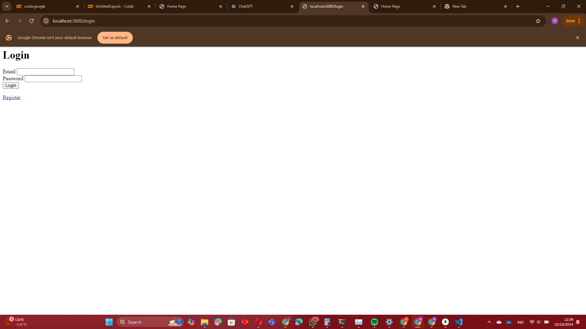
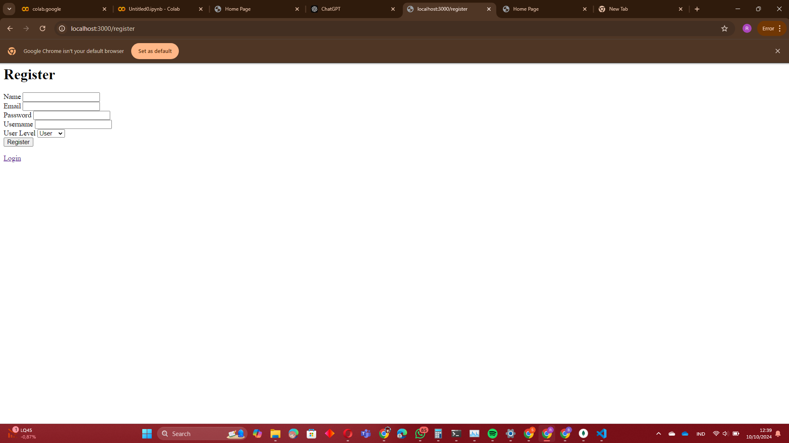
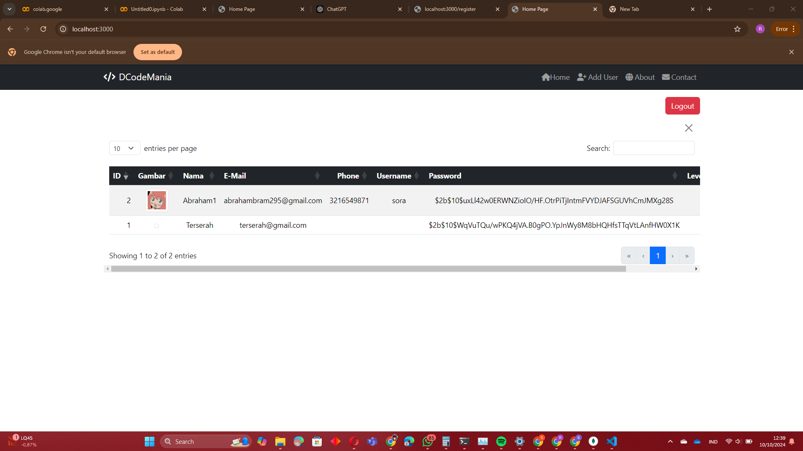
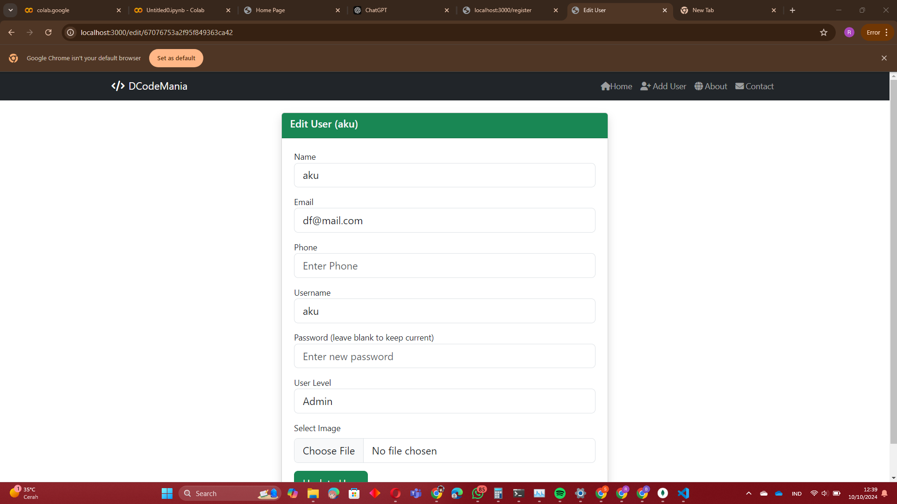
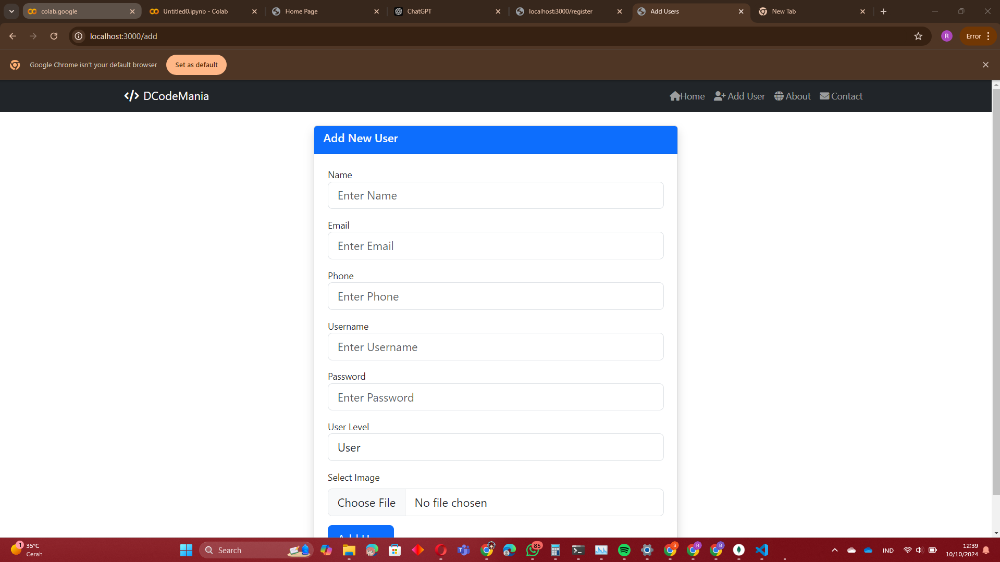

# Anggota Kelompok
- Abraham (21060122120030)

# Website Database Mahasiswa Teknik Elektro
Proyek ini adalah aplikasi web sederhana yang digunakan untuk mengelola data mahasiswa Teknik Elektro. Aplikasi ini memiliki fitur CRUD, yaitu memungkinkan pengguna untuk menambahkan (Create), melihat (Read), mengubah (Update), dan menghapus (Delete) data mahasiswa. Aplikasi ini dibangun menggunakan Node.js untuk menjalankan server, Express sebagai framework untuk mempermudah pengembangan, dan MongoDB sebagai database untuk menyimpan data. Tujuan aplikasi ini adalah untuk mempermudah pengelolaan dan pencarian data orang dengan cara yang lebih cepat, efisien, dan mudah digunakan. Dan terdapat untuk penambahan gambar.

---

## Instalasi

Menginstal dependensi proyek:

```shell
npm ci
```
Buat koneksi database MongoDB 
Siapkan aplikasi mongodb dan mongodb compass Anda dan perbarui konfigurasi database di file main.js dan passport-config.js dengan kredensial Anda.

Jalankan aplikasi:

```shell
npm start
```

---

## Screenshot
Halaman Login


Halaman Register


Halaman Utama
- Menampilkan daftar user yang sudah diinput
- Mengedit dan menghapus user
- Melakukan pencarian


Halaman Update


Fungsi Add New Data


---

## Keterangan
- Mengambil referensi dari https://www.youtube.com/watch?v=7NnBCKJTZkc&list=PL6u82dzQtlfvJoAWdyf5mUxPQRnNKCMGt&index=5 dan https://www.youtube.com/watch?v=-RCnNyD0L-s&list=WL&index=3&t=1600s sebagai program utama CRUD lalu dikembangkan dengan menambahkan login dan register page dengan sesi, tombol logout, dan fitur pencarian
- Pada database mongodb pada tabel user berisikan data orang dan pada tabel user berisikan nama, email, username, level, image dan password yang digunakan untuk autentikasi
